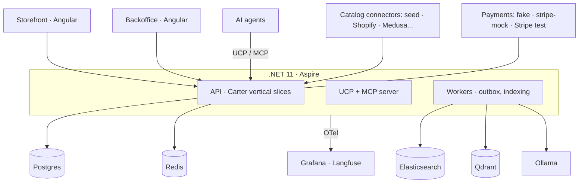

<p align="center">
  
</p>

<h1 align="center">Tendero</h1>
<p align="center"><em>The AI-native shopkeeper — commerce for humans and agents.</em></p>

<p align="center">
  <a href="https://github.com/{owner}/tendero/actions/workflows/ci.yml"></a>
  <a href="docs/search-evaluation.md"></a>
  <a href="https://codecov.io/gh/{owner}/tendero"></a>
  <a href="https://dotnet.microsoft.com"></a>
  <a href="https://angular.dev"></a>
  <a href="LICENSE"></a>
  <a href="https://elguerre.com"></a>
</p>

---

**Tendero** is Spanish for *shopkeeper*: the corner-shop owner who knows every
customer, recommends what actually fits, and remembers what you bought last
time. This project builds that shopkeeper as software — an AI-native ecommerce
platform in **.NET 11 + Aspire** and **Angular 22**, with a fully self-hosted AI
stack (Ollama, Qdrant, Elasticsearch) that runs on Docker at zero cost.

Most AI demos are Python notebooks. Tendero explores what **production-grade AI
engineering looks like in .NET**: hybrid search with regression tests, an
AI-enriched multilanguage catalog with human review, agent-ready commerce
(UCP/MCP), and observability for every token spent. It doubles as the companion
code for a blog series on AI architecture.

## Architecture at a glance



Key principles:

- **Two bounded contexts** (`Tendero.Catalog`, `Tendero.Ordering`) — orders
  snapshot product data, never reference it live.
- **Ports and adapters at every boundary**: N catalog connectors behind one
  port, 3 payment adapters behind another. The `seed` connector and `fake`
  payment provider are the defaults — clone and run, no sign-ups.
- **Lexical search (BM25) is the permanent fallback.** AI layers degrade
  gracefully; the store never stops searching.
- **Search quality is a CI gate**: a curated golden set is scored with NDCG@10
  on every PR.
- **Multilanguage by design** (es/en): per-culture indexes with native
  analyzers, `LocalizedText` value object, AI-assisted translation with human
  review.

Full plan: [docs/initial-plan.md](docs/initial-plan.md) ·
Architecture: [docs/architecture.md](docs/architecture.md) ·
ADRs: [docs/adr/](docs/adr/) ·
Design system: [design/DESIGN.md](design/DESIGN.md)

## Getting started

Prerequisites: [.NET 11 SDK (preview)](https://dotnet.microsoft.com), Docker
Desktop, Node 22+.

```bash
git clone https://github.com/{owner}/tendero.git
cd tendero

# Starts everything: API, workers, Postgres, Elasticsearch, Qdrant, Redis, Ollama, Grafana
dotnet run --project src/AppHost

# Import the sample catalog (seed connector, no external services needed)
curl -X POST http://localhost:5000/api/catalog/import -d '{"source":"seed"}' -H "Content-Type: application/json"

# Search it
curl "http://localhost:5000/api/search?q=zapatillas%20running&culture=es"
```

Frontends:

```bash
cd frontend && npm ci
npx nx serve storefront   # http://localhost:4200
npx nx serve backoffice   # http://localhost:4300
```

## Project structure

```
src/
  AppHost/                 # Aspire orchestration
  SharedKernel/            # Money, LocalizedText, ids, AggregateRoot
  Catalog/                 # bounded context: products, connectors, import slices
  Ordering/                # bounded context: orders, checkout, payments
  Search/                  # indexing, lexical + hybrid search
  Ucp/                     # UCP + MCP server for AI agents
frontend/                  # Angular workspace: storefront + backoffice + shared libs
brand/                     # logo, icons, brand guide
design/                    # tokens.css, Tailwind preset, design system
seed/                      # sample dataset (ABO-style schema, es/en)
tools/SearchEval/          # golden set runner (NDCG@10, recall)
docs/                      # plan, architecture, ADRs, specs, testing
tests/
```

## Testing strategy

| Layer | Tools | What it protects |
|---|---|---|
| Unit | xUnit v3, NSubstitute, Bogus, CsCheck | Domain invariants, value objects (property-based) |
| Contract | xUnit abstract suites | Every connector/payment adapter honors its port |
| Snapshot | Verify | Search documents, AI prompt outputs |
| Integration | Testcontainers, Respawn | Real Postgres + Elasticsearch, per-test isolation |
| Architecture | NetArchTest.Rules | Domain never references infra; slices stay independent |
| Search quality | Golden set + NDCG@10 in CI | Relevance never regresses silently |

```bash
dotnet test                                   # unit + contract + architecture
dotnet test --filter Category=Integration     # spins up containers
dotnet run --project tools/SearchEval         # relevance report
```

More: [docs/testing.md](docs/testing.md) · [docs/search-evaluation.md](docs/search-evaluation.md)

## Roadmap

| Phase | Feature | Status |
|---|---|---|
| 1 | Canonical multilanguage catalog + seed connector + import slice | ✅ designed |
| 1 | Lexical search (BM25, per-language indexes) | ✅ designed |
| 1 | Golden set + NDCG@10 as CI gate | 🔜 |
| 2 | Hybrid search (embeddings via Ollama + Qdrant, RRF) | 🔜 |
| 2 | AI catalog enrichment + translation with human review | 🔜 |
| 2 | Shopify connector (dev store) | 🔜 |
| 3 | Checkout, order saga, payment adapters | 🔜 |
| 3 | UCP + MCP server: agent-ready commerce | 🔜 |
| 4 | Multimodal search (image embeddings) | 🔜 |

## Blog series

Each phase ships with an article — English first, Spanish on
[elguerre.com](https://elguerre.com).

## License

MIT — see [LICENSE](LICENSE).
