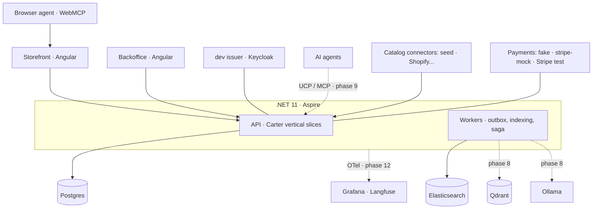

<h1 align="center">
  
</h1>

<p align="center">
  <a href="https://github.com/juanluelguerre/tendero/actions/workflows/ci.yml"></a>
  <a href="docs/search-evaluation.md"></a>
  <a href="https://dotnet.microsoft.com"></a>
  <a href="https://angular.dev"></a>
  <a href="https://www.typescriptlang.org"></a>
  <a href="LICENSE"></a>
  <a href="https://elguerre.com"></a>
</p>

---

**Tendero** is Spanish for *shopkeeper*: the corner-shop owner who knows every
customer, recommends what actually fits, and remembers what you bought last
time. This project builds that shopkeeper as software — an AI-native ecommerce
platform in **.NET 11 + Aspire** and **Angular 22**, with a fully self-hosted AI
stack (Ollama, Qdrant, Elasticsearch) that runs on Docker at zero cost.

Most AI demos are Python notebooks. Tendero explores what **production-grade AI
engineering looks like in .NET**: hybrid search with regression tests, an
AI-enriched multilanguage catalog with human review, agent-ready commerce
(UCP/MCP), and observability for every token spent. It doubles as the companion
code for a blog series on AI architecture.

### What runs today

Phases 0–7 of [the board](docs/delivery-plan.md) are in. That means the shop
works end to end, on a hundred-product catalogue, and a browser agent can shop
in it:

> Search it, put two things in a basket, and the cart shows one discount applied
> and **four suppressed, each with the reason the engine gave**. Pay with the
> card that declines and nothing happens — no order, no stock held, the basket
> untouched. Pay with the good one and stock is reserved and the order confirms
> itself through the outbox. Ship it: the money is captured and the shelf goes
> 4 → 2. Deliver it, send one back, and receiving puts the shelf at 3 before a
> euro moves.

**547 backend tests, 39 frontend tests and 20 browser specs**, with search
relevance at **NDCG@10 0.813 es / 0.766 en** over the hundred-product corpus
(re-derived when the catalogue grew from six — the old 0.943 / 0.937 are not
comparable, and [docs/search-evaluation.md](docs/search-evaluation.md) says
why) and a CI gate that fails a regression.

The AI half is the part that is designed and not built: embeddings, hybrid
search and the reranker are phase 8, the MCP server and the UCP manifest phase 9.
Everything they attach to — the outbox, a second projection target, a rebuildable
index, an evaluation harness with a committed baseline — is already here, which
is the order this project argues for.

## Architecture at a glance



Dotted edges are designed and not built; the phase each one lands in is on the
arrow. What is solid runs today.

Key principles:

- **Five bounded contexts that share no entities** — `Catalog`, `Pricing`,
  `Inventory`, `Ordering` and `Accounts`; `Search` is a projection over them,
  not a context. A crossing carries values or an event record, never a
  reference: an order snapshots the product's name and price, and stock is keyed
  on a SKU so inventory never learns what a product is (ADR 0014).
- **The outbox is the process manager.** Placing an order holds stock, failing
  to hold it cancels the order, and cancelling gives both the stock and the
  payment hold back — every arrow an ordinary event handler, no saga framework
  (ADR 0024).
- **Ports and adapters at every boundary**, each with an abstract contract suite
  every adapter inherits: catalog connectors, allocation strategies, tax
  calculators, shipping rates, payment providers, identity issuers. The `seed`
  connector, the `fake` payment provider and a development OIDC issuer are the
  defaults — clone and run, no sign-ups.
- **Three agent surfaces, three trust models.** WebMCP runs in the shopper's
  tab and inherits their session (shipped, phase 6); the MCP server is external
  and read-only (phase 9); UCP + AP2 is server to server with its own principal
  and a signed mandate (phase 11). Not alternatives — each answers a different
  question.
- **The identity provider is a port.** The API only ever validates tokens
  (OIDC discovery, JWKS, signed JWT); a development issuer signs them on a fresh
  clone and Keycloak does with two environment variables, behind one contract
  suite (ADR 0017).
- **Lexical search (BM25) is the permanent fallback.** AI layers degrade
  gracefully; the store never stops searching.
- **Search quality is a CI gate**: a curated golden set is scored with NDCG@10
  on every PR, and a regression fails it.
- **Multilanguage by design** (es/en): per-culture indexes with native
  analyzers, `LocalizedText` everywhere user-facing, and an explicit `?culture=`
  that beats `Accept-Language` because an agent has no browser locale
  (ADR 0013).

Full plan: [docs/initial-plan.md](docs/initial-plan.md) ·
Architecture: [docs/architecture.md](docs/architecture.md) ·
ADRs: [docs/adr/](docs/adr/) ·
Design system: [design/DESIGN.md](design/DESIGN.md) ·
Glossary: [docs/glossary.md](docs/glossary.md) — NDCG@10, BM25, UCP, the outbox
and the rest of the terms this README uses without stopping to define them

## Getting started

### Prerequisites

| | why this exact version |
|---|---|
| **.NET 11 SDK, preview** | `global.json` pins a prerelease floor. `11.0.100` plus `allowPrerelease` resolves *nothing* on a preview-only machine: roll-forward only rolls up, and a preview sorts below its own release. |
| **Node 24** (`.nvmrc`) | Angular 22 requires `^22.22.3 \|\| ^24.15.0 \|\| >=26.0.0`. Node 22.21 fails. |
| **Docker** | Postgres and Elasticsearch, roughly 2.5 GB on the first run. Keycloak, pgweb and elasticvue are declared too and start on demand from the dashboard. |

The repository runs on **Linux and Windows**. Nothing in the code assumes a
platform — every path is built with `Path.Combine` — but the setup commands
differ.

**Linux / macOS**

```bash
curl -sSL https://dot.net/v1/dotnet-install.sh | bash -s -- --channel 11.0 --quality preview
export PATH="$HOME/.dotnet:$PATH"          # add it to your shell profile

nvm install && nvm use                     # reads .nvmrc
```

**Windows (PowerShell)**

```powershell
winget install Microsoft.DotNet.SDK.Preview

# nvm-windows does NOT read .nvmrc — pass the version explicitly
nvm install 24
nvm use 24
```

Use winget, not `dotnet-install.ps1`. On Windows that script ignores
`%USERPROFILE%\.dotnet` and installs into `%LOCALAPPDATA%\Microsoft\dotnet`,
which is a second dotnet root: it only exists on the PATH of the shell that ran
the script, and Rider and Visual Studio keep resolving the release SDK next to
it. winget installs the same build into `C:\Program Files\dotnet` beside the
10.x SDKs, so `global.json` picks it up everywhere, including the IDE.

Docker Desktop on Windows needs at least 4 GB allocated to its WSL2 backend:
Elasticsearch alone asks for a 1 GB heap.

### Run everything

```bash
git clone https://github.com/{owner}/tendero.git
cd tendero
(cd frontend && npm ci)

dotnet run --project src/AppHost
```

One command brings up Postgres, Elasticsearch, the API, the outbox worker and
**both Angular apps**, with the Aspire dashboard in front. The frontends get the
API address injected, so no URL is hardcoded anywhere in application code.
Every fixed port is deliberately off its default — 5432 and 9200 are somebody's
work services — and Keycloak, pgweb and elasticvue are declared but only start
when you press *Start* on the dashboard (`src/AppHost/README.md`).

| | |
|---|---|
| Storefront | http://localhost:4200 |
| Backoffice | http://localhost:4201 |
| Aspire dashboard | http://localhost:15130 |
| Postgres · Elasticsearch | 55432 · 59200 |

Then import the sample catalogue and search it — through the storefront's own
dev-server proxy, which is the same path the browser uses:

```bash
curl -X POST http://localhost:4200/api/catalog/import \
     -H 'Content-Type: application/json' -d '{"source":"seed"}'

curl "http://localhost:4200/api/search?q=zapatillas%20running&culture=es"
```

Imported products land as `Draft`, and **only `Active` is indexed**: importing
never publishes, because the review stage is the point. Publish them from the
backoffice review queue at http://localhost:4201/review, or over HTTP:

```bash
# what is waiting for review
curl "http://localhost:4201/api/catalog/products?status=draft&culture=es"

curl -X POST http://localhost:4201/api/catalog/products/{id}/publish
```

If the index ever comes back empty — Elasticsearch runs without a volume on
purpose, so recreating its container loses the documents while Postgres keeps
the catalogue — rebuild it from Postgres instead of reimporting:

```bash
curl -X POST http://localhost:4200/api/search/reindex   # {"indexed":100,"removed":0,…}
```

### The search quality gate

```bash
docker run -d --name tendero-es -p 9200:9200 \
  -e discovery.type=single-node -e xpack.security.enabled=false \
  docker.elastic.co/elasticsearch/elasticsearch:9.5.0

dotnet run --project tools/SearchEval          # report
dotnet run --project tools/SearchEval -- --ci  # exits 1 below the thresholds
```

### Everything else

```bash
dotnet build Tendero.slnx            # warnings become errors when CI is set
                                     #   bash:       CI=true dotnet build …
                                     #   PowerShell: $env:CI="true"; dotnet build …
dotnet test Tendero.slnx             # unit, contract and architecture tests
cd frontend && npx nx run-many -t lint test build
```

The browser specs need the stack running and Chromium installed once:

```bash
cd frontend && npx playwright install chromium
npx nx e2e storefront-e2e     # the shopper, and the browser agent
npx nx e2e backoffice-e2e     # the shopkeeper
```

`npx nx` when you type it, `nx` inside a `package.json` script — Nx is a local
dependency, and the prefix is about who resolves the command. The reasoning is
in [frontend/README.md](frontend/README.md).

## Project structure

```
src/
  AppHost/                 # Aspire orchestration
  SharedKernel/            # Money, LocalizedText, Address, ids, AggregateRoot, CQRS
  Catalog/                 # products, variants, attributes, categories, connectors
  Pricing/                 # price lists, promotions, tax — references SharedKernel ONLY
  Inventory/               # warehouses, stock, reservations — SharedKernel only too
  Ordering/                # cart, checkout, orders, payments, returns, the stock saga
  Accounts/                # customers and guests, the guest claim, the audit log's reader
  Search/                  # indexing and lexical search (hybrid in phase 8)
  Ucp/                     # UCP + MCP server for AI agents (phase 9; a README today)
  DevIssuer/               # OIDC discovery, JWKS and signed tokens, Development only
  Api/  Workers/           # composition roots: HTTP endpoints, outbox processor
  Persistence/             # the only project that knows EF Core exists
  ServiceDefaults/         # OTel, health checks, service discovery
frontend/                  # Nx workspace
  apps/storefront/         # light, roomy: home, search, product page, cart, checkout, orders, account
  apps/backoffice/         # dense, dark: review, attributes, promotions, stock, orders, returns, audit
  apps/*-e2e/              # Playwright — the thinnest layer of the pyramid
  libs/shared/             # tokens, ui, util, api, i18n, auth, agent — boundaries enforced by lint
keycloak/                  # the committed realm: users, roles and clients for a fresh clone
brand/                     # logo, icons, brand guide
design/                    # tokens.css — the single source of truth for four surfaces
seed/                      # sample dataset (ABO-style schema, es/en)
tools/SearchEval/          # golden set runner (NDCG@10, recall)
docs/                      # plan, architecture, ADRs, analysis, testing, blog
tests/                     # unit, contract, architecture, integration, API
```

## Testing strategy

**547 backend tests, 39 frontend tests and 20 browser specs**, and the table
below is what each layer is for. Only tools actually in the repository are
listed: NSubstitute, Bogus and Verify are still prescribed by `docs/testing.md`
and still absent, and Respawn was declined — a fresh database per test turned
out cheaper than a reset.

| Layer | Tools | What it protects |
|---|---|---|
| Unit | xUnit v3 | Domain invariants and every transition table, walked in full |
| Property-based | CsCheck | The promotion engine over thousands of generated carts — it found a real bug |
| Contract | xUnit abstract suites | Every connector, allocation strategy, tax calculator, shipping rate, payment provider and identity issuer honours its port |
| Architecture | NetArchTest.Rules | Domain never references infra; slices stay independent; `Pricing` and `Inventory` see only the SharedKernel |
| Integration | Testcontainers | A real Postgres: the outbox drain, the migration baseline, and the commerce loop end to end |
| API in process | `WebApplicationFactory` | The OpenAPI document equals the committed one; every endpoint states who may call it; every handler resolves; the OIDC contract against both issuers |
| Frontend | vitest | The culture store, the agent tools and their degradation, and not one hex outside `design/tokens.css` across every stylesheet in the repo |
| Search quality | Golden set + NDCG@10 in CI | Relevance never regresses silently |
| End-to-end | Playwright | The browser: the route guard, the token interceptor, and a table that never keeps its own copy of a state machine |

```bash
dotnet test                                   # unit, property, contract, architecture
dotnet test --filter Category=Integration     # spins up containers
dotnet run --project tools/SearchEval         # relevance report
cd frontend && npx nx run-many -t lint test   # boundaries, tokens, unit tests
npx nx e2e storefront-e2e backoffice-e2e      # needs the stack up
```

More: [docs/testing.md](docs/testing.md) · [docs/search-evaluation.md](docs/search-evaluation.md)

## Roadmap

The living board — what is next, what each phase evidences, and what was
deferred with its measured number — is
**[docs/delivery-plan.md](docs/delivery-plan.md)**. This is the short version.

| Phase | | Status |
|---|---|---|
| 0 | CI, OpenAPI contract, migrations, Testcontainers, the identity port | ✅ |
| 1 | Variants: the indexed unit is the variant, the returned one the product | ✅ |
| 2 | Localized attributes and taxonomy | ✅ **es 0.860 → 0.943, en 0.720 → 0.937** |
| 3 | Price lists, promotions with combination rules, tax | ✅ 73 pricing tests |
| 4 | Inventory: two warehouses, reservations, the stock saga on the outbox | ✅ |
| 5 | Cart, checkout, payments, returns, the product page | ✅ |
| 6 | WebMCP in the storefront | ✅ the cheapest differentiator — the agent inherits the shopper's session |
| 7 | Accounts, audit, and swapping the dev issuer for Keycloak | ✅ the swap was two environment variables; Token Exchange waits for phase 11 |
| 8 | Embeddings, hybrid search, evals | 🔜 |
| 9 | Read-only MCP server and the UCP manifest | 🔜 |
| 10 | Knowledge: product claims with source and confidence | 🔜 |
| 11 | UCP transactional, AP2 and Know Your Agent | 🔜 **the headline** |
| 12 | Backoffice copilot and AI observability | 🔜 |
| 13 | Multimodal search and the kit solver | 🔜 |

The numbering changed on 2026-09-02: `initial-plan.md` §7 had four phases, the
review that produced `docs/analysis/` reordered the work by **what it evidences**
rather than by what is cheap, and the board is the one that is maintained.

## Blog series

Each phase ships with an article — English first, Spanish on
[elguerre.com](https://elguerre.com).

**Nothing is published yet**, and the first date is 2026-09-15.
[docs/blog/index.md](docs/blog/index.md) owns the publication order, the status of
each article and what the unfinished ones are waiting on — nine are drafted from
shipped features and measured numbers, plus two outlines writable today, which
is roughly four and a half months of publishing without writing a new line.

Raw material is collected as it happens in
[docs/blog/notebook.md](docs/blog/notebook.md), which is where the numbers and the
mistakes live — including the ones that cost an afternoon.

## License

MIT — see [LICENSE](LICENSE).
