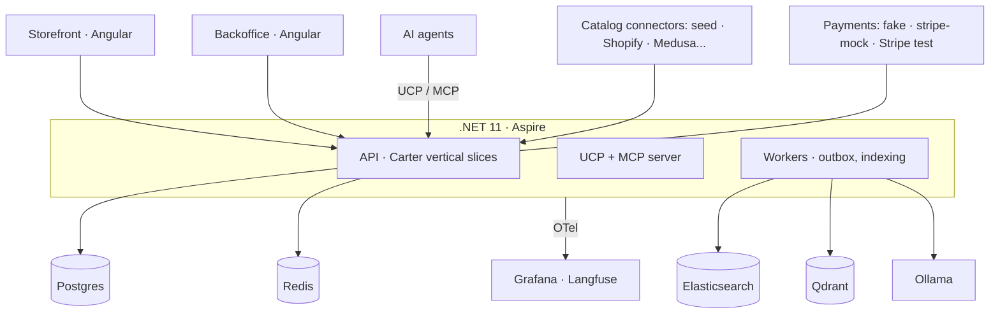

<p align="center">
  
</p>

<h1 align="center">Tendero</h1>
<p align="center"><em>The AI-native shopkeeper — commerce for humans and agents.</em></p>

<p align="center">
  <a href="docs/search-evaluation.md"></a>
  <a href="https://dotnet.microsoft.com"></a>
  <a href="https://angular.dev"></a>
  <a href="LICENSE"></a>
  <a href="https://elguerre.com"></a>
</p>

---

**Tendero** is Spanish for *shopkeeper*: the corner-shop owner who knows every
customer, recommends what actually fits, and remembers what you bought last
time. This project builds that shopkeeper as software — an AI-native ecommerce
platform in **.NET 11 + Aspire** and **Angular 22**, with a fully self-hosted AI
stack (Ollama, Qdrant, Elasticsearch) that runs on Docker at zero cost.

Most AI demos are Python notebooks. Tendero explores what **production-grade AI
engineering looks like in .NET**: hybrid search with regression tests, an
AI-enriched multilanguage catalog with human review, agent-ready commerce
(UCP/MCP), and observability for every token spent. It doubles as the companion
code for a blog series on AI architecture.

## Architecture at a glance



Key principles:

- **Two bounded contexts** (`Tendero.Catalog`, `Tendero.Ordering`) — orders
  snapshot product data, never reference it live.
- **Ports and adapters at every boundary**: N catalog connectors behind one
  port, 3 payment adapters behind another. The `seed` connector and `fake`
  payment provider are the defaults — clone and run, no sign-ups.
- **Lexical search (BM25) is the permanent fallback.** AI layers degrade
  gracefully; the store never stops searching.
- **Search quality is a CI gate**: a curated golden set is scored with NDCG@10
  on every PR.
- **Multilanguage by design** (es/en): per-culture indexes with native
  analyzers, `LocalizedText` value object, AI-assisted translation with human
  review.

Full plan: [docs/initial-plan.md](docs/initial-plan.md) ·
Architecture: [docs/architecture.md](docs/architecture.md) ·
ADRs: [docs/adr/](docs/adr/) ·
Design system: [design/DESIGN.md](design/DESIGN.md)

## Getting started

### Prerequisites

| | why this exact version |
|---|---|
| **.NET 11 SDK, preview** | `global.json` pins a prerelease floor. `11.0.100` plus `allowPrerelease` resolves *nothing* on a preview-only machine: roll-forward only rolls up, and a preview sorts below its own release. |
| **Node 24** (`.nvmrc`) | Angular 22 requires `^22.22.3 \|\| ^24.15.0 \|\| >=26.0.0`. Node 22.21 fails. |
| **Docker** | Postgres and Elasticsearch. Roughly 2.5 GB on the first run. |

The repository runs on **Linux and Windows**. Nothing in the code assumes a
platform — every path is built with `Path.Combine` — but the setup commands
differ.

**Linux / macOS**

```bash
curl -sSL https://dot.net/v1/dotnet-install.sh | bash -s -- --channel 11.0 --quality preview
export PATH="$HOME/.dotnet:$PATH"          # add it to your shell profile

nvm install && nvm use                     # reads .nvmrc
```

**Windows (PowerShell)**

```powershell
Invoke-WebRequest https://dot.net/v1/dotnet-install.ps1 -OutFile dotnet-install.ps1
./dotnet-install.ps1 -Channel 11.0 -Quality preview
$env:PATH = "$env:USERPROFILE\.dotnet;$env:PATH"   # add it to your profile

# nvm-windows does NOT read .nvmrc — pass the version explicitly
nvm install 24
nvm use 24
```

Docker Desktop on Windows needs at least 4 GB allocated to its WSL2 backend:
Elasticsearch alone asks for a 1 GB heap.

### Run everything

```bash
git clone https://github.com/{owner}/tendero.git
cd tendero
(cd frontend && npm ci)

dotnet run --project src/AppHost
```

One command brings up Postgres, Elasticsearch, the API, the outbox worker and
**both Angular apps**, with the Aspire dashboard in front. The frontends get the
API address injected, so no URL is hardcoded anywhere in application code.

| | |
|---|---|
| Storefront | http://localhost:4200 |
| Backoffice | http://localhost:4201 |
| Aspire dashboard | http://localhost:15130 |

Then import the sample catalogue and search it — through the storefront's own
dev-server proxy, which is the same path the browser uses:

```bash
curl -X POST http://localhost:4200/api/catalog/import \
     -H 'Content-Type: application/json' -d '{"source":"seed"}'

curl "http://localhost:4200/api/search?q=zapatillas%20running&culture=es"
```

Imported products land as `Draft`, and only `Active` is indexed — the review
queue that publishes them is phase 2. Until then, flip them by hand in Postgres
and reimport to trigger the projection.

### The search quality gate

```bash
docker run -d --name tendero-es -p 9200:9200 \
  -e discovery.type=single-node -e xpack.security.enabled=false \
  docker.elastic.co/elasticsearch/elasticsearch:9.1.0

dotnet run --project tools/SearchEval          # report
dotnet run --project tools/SearchEval -- --ci  # exits 1 below the thresholds
```

### Everything else

```bash
dotnet build Tendero.slnx            # warnings become errors when CI is set
                                     #   bash:       CI=true dotnet build …
                                     #   PowerShell: $env:CI="true"; dotnet build …
dotnet test Tendero.slnx             # unit, contract and architecture tests
cd frontend && npx nx run-many -t lint,test,build
```

## Project structure

```
src/
  AppHost/                 # Aspire orchestration
  SharedKernel/            # Money, LocalizedText, ids, AggregateRoot
  Catalog/                 # bounded context: products, connectors, import slices
  Ordering/                # bounded context: orders, checkout, payments
  Search/                  # indexing, lexical + hybrid search
  Ucp/                     # UCP + MCP server for AI agents
  Api/  Workers/            # composition roots: HTTP endpoints, outbox processor
  Persistence/             # the only project that knows EF Core exists
  ServiceDefaults/         # OTel, health checks, service discovery
frontend/                  # Nx workspace
  apps/storefront/         # light, roomy; search wired to the real API
  apps/backoffice/         # dense, dark; review queue
  libs/shared/             # tokens, ui, util, api, i18n — boundaries enforced by lint
brand/                     # logo, icons, brand guide
design/                    # tokens.css — the single source of truth for both apps
seed/                      # sample dataset (ABO-style schema, es/en)
tools/SearchEval/          # golden set runner (NDCG@10, recall)
docs/                      # plan, architecture, ADRs, specs, testing
tests/
```

## Testing strategy

| Layer | Tools | What it protects |
|---|---|---|
| Unit | xUnit v3, NSubstitute, Bogus, CsCheck | Domain invariants, value objects (property-based) |
| Contract | xUnit abstract suites | Every connector/payment adapter honors its port |
| Snapshot | Verify | Search documents, AI prompt outputs |
| Integration | Testcontainers, Respawn | Real Postgres + Elasticsearch, per-test isolation |
| Architecture | NetArchTest.Rules | Domain never references infra; slices stay independent |
| Search quality | Golden set + NDCG@10 in CI | Relevance never regresses silently |

```bash
dotnet test                                   # unit + contract + architecture
dotnet test --filter Category=Integration     # spins up containers
dotnet run --project tools/SearchEval         # relevance report
```

More: [docs/testing.md](docs/testing.md) · [docs/search-evaluation.md](docs/search-evaluation.md)

## Roadmap

| Phase | Feature | Status |
|---|---|---|
| 1 | Canonical multilanguage catalog + seed connector + import slice | ✅ designed |
| 1 | Lexical search (BM25, per-language indexes) | ✅ designed |
| 1 | Golden set + NDCG@10 as CI gate | 🔜 |
| 2 | Hybrid search (embeddings via Ollama + Qdrant, RRF) | 🔜 |
| 2 | AI catalog enrichment + translation with human review | 🔜 |
| 2 | Shopify connector (dev store) | 🔜 |
| 3 | Checkout, order saga, payment adapters | 🔜 |
| 3 | UCP + MCP server: agent-ready commerce | 🔜 |
| 4 | Multimodal search (image embeddings) | 🔜 |

## Blog series

Each phase ships with an article — English first, Spanish on
[elguerre.com](https://elguerre.com).

## License

MIT — see [LICENSE](LICENSE).
