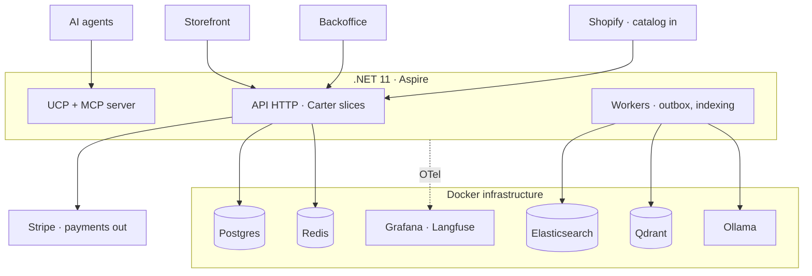
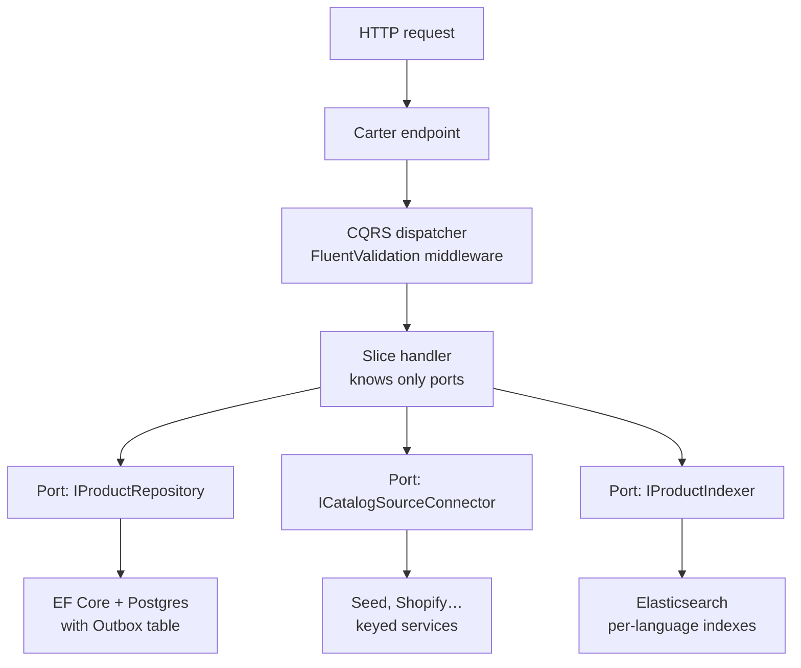
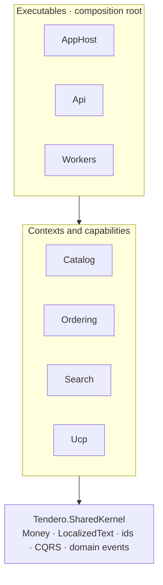

# Architecture

## Three planes

1. **Inbound** — catalog connectors (`ICatalogSourceConnector`): seed (default),
   Shopify dev store, Medusa/Vendure/WooCommerce/PrestaShop, Merchant feed.
   Keyed DI by source name; contract-test suite per adapter; idempotent import
   keyed on `(source, externalId)` via `ExternalReference`.
2. **Core** — `Tendero.Catalog` and `Tendero.Ordering` bounded contexts.
   Vertical slices (Carter endpoints + FluentValidation + custom CQRS
   dispatchers). Postgres is the source of truth; every side effect flows
   through domain events → Outbox (same transaction) → workers.
3. **Exposure** — storefront and backoffice (Angular) over HTTP; UCP + MCP
   server for AI agents (phase 3), with AP2 mandate handling and an agent
   activity panel in the backoffice.

## Canonical model

- `Product` (Catalog): `LocalizedText` name/slug/description (es/en with
  fallback chain), typed attributes, images, `ExternalReferences`, status
  Draft → Active → Archived. Draft = imported or AI-generated, awaiting review;
  only Active is indexed.
- `Order` (Ordering): line snapshots (name resolved in the buyer's culture,
  price frozen), declarative `AllowedTransitions` table, `IdempotencyKey` on
  checkout (agent retries are the normal case), `Culture`.
- SharedKernel: `Money`, `LocalizedText`, strongly-typed ids, `AggregateRoot`
  with domain-event collection.

## Search

- Index = disposable projection. One index per language with the native
  analyzer (`products_es` / `products_en`). Reindex from Postgres at will.
- Lexical (BM25) is the permanent fallback; hybrid (Qdrant + RRF + rerank) and
  every AI layer sit behind feature flags and degrade to lexical.
- Multilingual embeddings (bge-m3 via Ollama) → one vector space serves both
  cultures.
- Quality is tested: golden set per culture, NDCG@10 + recall@50 in CI.

## Payments

One port, three adapters: Fake (in-process, failure injection, default),
stripe-mock (protocol contract tests), Stripe test mode (real webhooks).
The order saga compensates via `Order.Cancel(reason)` from any intermediate
state.

## Observability

OpenTelemetry from slice 1: every I/O slice opens an `ActivitySource` span with
tags (source, counts, took, tokens). GenAI semantic conventions for LLM calls.
Aspire dashboard in dev; Grafana stack + Langfuse (self-hosted) as the
persistent view. Outbox lag is a first-class metric.

## Diagrams

### General architecture (containers)

### Component view (one vertical slice)

### Solution blueprint (project references point down only)

Architecture tests (`docs/testing.md`) enforce the downward-only rule; the
`tests/` and `frontend/` trees sit beside these layers without entering them.
