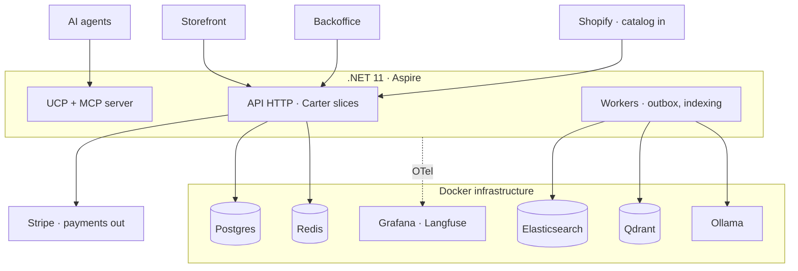
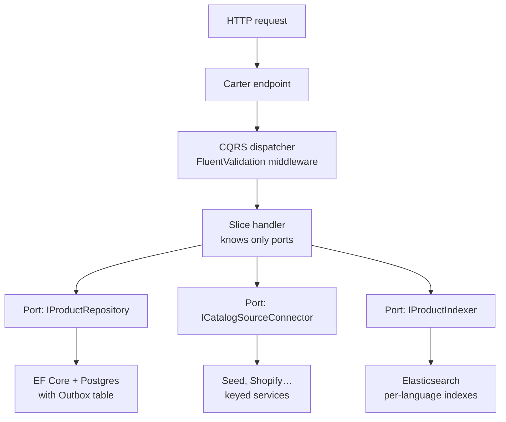
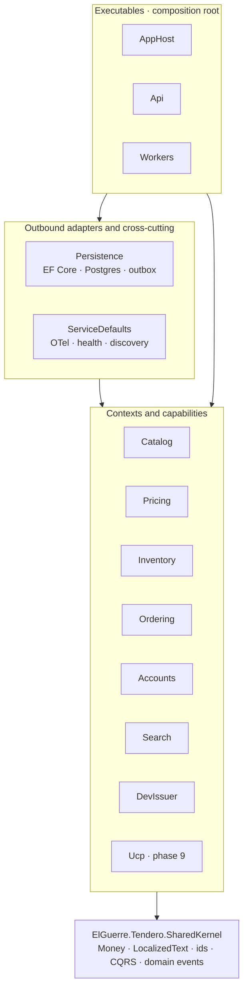

# Architecture

## Three planes

1. **Inbound** — catalog connectors (`ICatalogSourceConnector`): seed (default),
   Shopify dev store, Medusa/Vendure/WooCommerce/PrestaShop, Merchant feed.
   Keyed DI by source name; contract-test suite per adapter; idempotent import
   keyed on `(source, externalId)` via `ExternalReference`.
2. **Core** — the bounded contexts: `ElGuerre.Tendero.Catalog`,
   `ElGuerre.Tendero.Pricing`, `ElGuerre.Tendero.Inventory`,
   `ElGuerre.Tendero.Ordering` and `ElGuerre.Tendero.Accounts`. They share no
   entities (ADR 0014); `Pricing` and `Inventory` reference SharedKernel alone,
   which is what makes the promotion engine a function of values and the
   allocation strategies testable without a database. `Search` is a projection
   over them, not a context (ADR 0007), and the `audit` schema belongs to none of
   them: every context writes to it through the dispatcher, `Accounts` reads it.
   Vertical slices (Carter endpoints + FluentValidation + custom CQRS
   dispatchers). Postgres is the source of truth; every side effect flows
   through domain events → Outbox (same transaction) → workers.
3. **Exposure** — storefront and backoffice (Angular) over HTTP, behind an
   OIDC issuer the API only ever validates (ADR 0017); WebMCP in the shopper's
   tab (phase 6, shipped); the read-only MCP server and the UCP manifest (phase
   9); UCP transactional with AP2 mandate handling and an agent activity panel in
   the backoffice (phase 11).

## Canonical model

- `Product` (Catalog): `LocalizedText` name/slug/description (es/en with
  fallback chain), typed attributes, images, `ExternalReferences`, status
  Draft → Active → Archived. Draft = imported or AI-generated, awaiting review;
  only Active is indexed. **Publishing is an explicit step** — importing never
  does it — exposed as `POST /api/catalog/products/{id}/publish` and driven from
  the backoffice review queue. Idempotent: publishing what is already Active
  reports it and saves nothing (ADR 0012).
- `Order` (Ordering): line snapshots (name resolved in the buyer's culture,
  price frozen), declarative `AllowedTransitions` table, `IdempotencyKey` on
  checkout (agent retries are the normal case), `Culture`.
- `Cart` and `ReturnRequest` (Ordering) and `Reservation` (Inventory): each
  with its own `TransitionTable`, for the reasons the sections below give.
- `Customer` (Accounts): a nullable `Subject`, so a guest is a customer with no
  identity rather than the absence of one; superseded, never deleted, when an
  account absorbs it.
- SharedKernel: `Money`, `LocalizedText`, `Address`, strongly-typed ids,
  `TransitionTable<TStatus>`, `AggregateRoot` with domain-event collection, and
  the CQRS dispatchers with their two pipeline steps — validation and audit.

## Search

- Index = disposable projection. One index per language with the native
  analyzer (`products_es` / `products_en`). Rebuilt from Postgres with
  `POST /api/search/reindex`, which replays the outbox projection's rule — Active
  is indexed, everything else removed — so it converges rather than merely adds.
  Elasticsearch runs without a volume on purpose; the rebuild is what makes that
  safe (ADR 0012).
- Lexical (BM25) is the permanent fallback; hybrid (Qdrant + RRF + rerank) and
  every AI layer sit behind feature flags and degrade to lexical.
- Multilingual embeddings (bge-m3 via Ollama) → one vector space serves both
  cultures.
- Quality is tested: golden set per culture, NDCG@10 + recall@50 in CI.

## HTTP surface

Everything the API exposes today. Each is one vertical slice.

| Endpoint | Slice |
|---|---|
| `GET /api/auth/config` | `Api/AuthConfigurationEndpoint` — which issuer this process trusts |
| `POST /api/catalog/import` | `Catalog/Features/ImportProducts` |
| `GET /api/catalog/products` | `Catalog/Features/ListProducts` |
| `GET /api/catalog/products/{code}` | `Catalog/Features/GetProduct` |
| `POST /api/catalog/products/{id}/publish` | `Catalog/Features/PublishProduct` |
| `GET /api/images/{id}` | `Catalog/Features/GetProductImage` |
| `GET /api/catalog/attributes` | `Catalog/Features/ListAttributeDefinitions` |
| `GET /api/catalog/categories` | `Catalog/Features/ListCategories` |
| `GET /api/catalog/skus` | `Catalog/Features/DescribeSkus` — names for the stock grid, across the Inventory boundary |
| `POST /api/catalog/products/{id}/variants` | `Catalog/Features/DefineVariants` |
| `POST /api/pricing/quote` | `Pricing/Features/QuoteCart` |
| `GET /api/pricing/promotions` | `Pricing/Features/ListPromotions` |
| `GET /api/pricing/offers` | `Pricing/Features/ListOffers` — what the home page shows |
| `GET /api/inventory/stock` | `Inventory/Features/ListStock` |
| `PUT /api/inventory/stock/{sku}/{warehouse}` | `Inventory/Features/ListStock` (CountStock) |
| `GET /api/cart` | `Ordering/Features/ManageCart` |
| `POST /api/cart/lines` | `Ordering/Features/ManageCart` (AddToCart) |
| `PUT`/`DELETE /api/cart/lines/{sku}` | `Ordering/Features/ManageCart` (SetCartLine) |
| `POST /api/cart/claim` | `Ordering/Features/ManageCart` (ClaimCart) — attaches a guest's basket after sign-in |
| `POST /api/checkout/shipping-options` | `Ordering/Features/Checkout` (GetShippingOptions) |
| `POST /api/checkout` | `Ordering/Features/Checkout` (PlaceOrder) |
| `GET /api/orders` | `Ordering/Features/ListOrders` |
| `GET /api/orders/{id}` | `Ordering/Features/GetOrder` |
| `GET /api/orders/mine` | `Ordering/Features/ListOrders` (MyOrders) — a separate slice from the shopkeeper's list on purpose |
| `POST /api/orders/{id}/move` | `Ordering/Features/ListOrders` (MoveOrder) |
| `POST /api/orders/{id}/returns` | `Ordering/Features/Returns` (RequestReturn) |
| `GET /api/returns` | `Ordering/Features/Returns` (ListReturns) |
| `POST /api/returns/{id}/decide` | `Ordering/Features/Returns` (DecideReturn) |
| `POST /api/payments/{provider}/webhook` | `Ordering/Features/PaymentWebhook` |
| `GET /api/search` | `Search/Features/SearchProducts` — also browses: `?category=` and `?sort=newest` with no `q` |
| `POST /api/search/reindex` | `Search/Features/ReindexProducts` |
| `POST /api/accounts/me` | `Accounts/Features/LinkIdentity` — the subject comes from the token, never from the body |
| `GET /api/audit` | `Accounts/Features/ListAuditEntries` — opens on the refusals |

Plus the development issuer's own surface under `/dev-issuer` in Development —
discovery, JWKS, `/connect/authorize`, `/connect/token`, `/connect/logout` — which
is protocol, not product, and is exempt from the endpoint-policy test.

Any of them returning localized text resolves culture the same way — explicit
`?culture=` → `Accept-Language` → `es` — and answers with `Content-Language` and
`Vary: Accept-Language` (ADR 0013).

## Pricing

Prices are **quoted live and frozen at order time** (ADR 0016). `Pricing` is a
pure context: price lists, promotions and tax calculation take values in and
return values out, with the instant passed as an argument rather than read from
a clock. That is what lets the combination rules be verified with property tests
over thousands of generated carts.

Combination is a declarative table in the `AllowedTransitions` idiom —
`ExclusiveGlobal` stops evaluation, `ExclusiveInGroup` closes its group,
`Stackable` continues — evaluated in the total order `(Priority, Code)`. A
suppressed promotion is returned with its `RuleReason`, in both cultures, because
a discount that did not apply and a discount of zero look identical in a total.

A `PriceQuote` carries an expiry and a fingerprint over **both** the request and
the pricing data it was answered with, so a tariff edit invalidates the quotes it
would otherwise keep promising.

## Inventory, and the saga that was already there

Stock is keyed on **SKU**, not on `VariantId`: the SKU is the vocabulary the two
contexts share, exactly as `ProductName` is between Catalog and Ordering. Two
warehouses, `StockItem` with `OnHand`/`Reserved`/derived `Available`, and
`Reservation` with its own four-state transition table.

The process is **orchestrated from `Ordering` over the existing outbox** — three
`IDomainEventHandler<T>` and no framework (ADR 0024):

```
Order.Place()      → OrderPlaced     → IStockLedger.Reserve → held | refused
refused                              → order.Cancel(reason) → OrderCancelled
OrderCancelled                       → IStockLedger.Release        (compensation)
OrderShipped                         → IStockLedger.Commit
```

Holding stock does **not** confirm the order: `AllowedTransitions` routes
`Pending → PaymentAuthorized → Confirmed`, and stock says nothing about payment.

A stocktake is a different operation from a delivery, and only a stocktake can
say zero — which is what puts an out-of-stock shelf on the record rather than no
row at all. Both raise `StockLevelChanged`, so a count typed in the backoffice
reaches the search index by the same path an order takes.

## Cart and checkout

`Cart` is an aggregate **inside** `Ordering`, not a context: cart to order is one
transactional conversion, and splitting it would buy a distributed saga to move a
row between two states. Guests are first class — the cart is addressed by a
256-bit token, and a `CustomerId` is minted at checkout.

**The cart carries no money.** Prices are quoted live and frozen at order time
(ADR 0016), so every figure a shopper sees comes from `POST /api/pricing/quote`,
recomputed after each change. That costs a second round trip per click and is
what keeps `Ordering` from owning a second pricing engine.

Checkout **authorises before it places** (ADR 0025), so a declined card costs
nothing: no order, no reservation, an untouched cart. The quote is revalidated by
re-running the engine that issued it, through one adapter an architecture rule
confines to a single file — a checkout with its own arithmetic would compare two
fingerprints from two systems and call the agreement proof.

Shipping lives here and tax lives in `Pricing`, and the split is deliberate: a
rate needs an address, and dragging `Address` into `Pricing` would ruin the
purity that makes the promotion engine property-testable. The chosen rate then
feeds back into `Pricing` as the input `FreeShipping` needs. Both directions are
values, so the loop is fine.

## Returns

**A return is not a state of the order.** They are per LINE, which a seven-state
order machine cannot express without a combinatorial explosion, so
`ReturnRequest` is its own aggregate with its own table:

```
Requested → Approved | Rejected | Cancelled
Approved  → Received | Cancelled
Received  → Refunded | Rejected
```

The window opens on `OrderDelivered` — the event phase 1 added with a comment
saying it existed for exactly this. **Receiving** restocks through
`IStockLedger.ReceiveAsync`, not approving: approving is a promise and a shop
that restocked on one would be selling parcels still in the post. Damaged goods
never restock at all.

`ReturnReason` is a closed set of five, and the closure is the point: it is the
input to the return-reason analysis a later phase promises, and a text box would
make that a language model guessing at what somebody typed.

## Payments

One port, **four** operations — authorise, capture, refund and void — with keyed
adapters and a shared contract suite. Today one adapter: `fake`, in-process, with
failure injected through the instrument so a decline, an unreachable provider and
an authorise-then-fail are one click apart in the demo. `stripe-mock` and Stripe
test mode remain the second and third.

Void is not refund and the port refuses to let them be confused: a refund takes a
**capture** reference and a void takes an **authorisation**, because crediting
money that was never taken is a different conversation with the customer and with
the bank.

Capture happens on **shipping**, for the reason stock is committed there:
confirming is a promise and shipping is a fact. The order saga compensates via
`Order.Cancel(reason)` from any intermediate state, releasing both the stock and
the payment hold.

The webhook is the one endpoint a stranger is supposed to call, so the signature
is the whole security model: HMAC-SHA256 over `<timestamp>.<raw body>`, compared
in fixed time, with a five-minute tolerance that stops a captured request being
replayed tomorrow.

## Agent surfaces

Tendero ends up with **three**, and their trust models differ. That difference is
the interesting part, and it is why they are three features rather than three
implementations of one.

| Surface | The agent is | Authorization | Phase |
|---|---|---|---|
| **WebMCP** | code inside the user's own browser session | **inherits** it — no second principal, no token, no mandate | 6 (done) |
| **MCP server** | an external process | `AllowAnonymous` by explicit decision; read-only | 9 |
| **UCP + AP2** | its own principal, server to server | bearer token plus a signed mandate | 11 |

**WebMCP ships.** `libs/shared/agent` holds the registration mechanism — the
browser's `ModelContext` reached through an injection token, so the degradation
is testable where it actually happens — and each app owns its own tool set
(ADR 0010): behaviour is shared, identity is not. The storefront offers
`search_products`, `get_product`, `add_to_cart` and `get_cart`, all in one file
so a specification change is one edit.

**Tools call the same Angular services the interface calls**, and an eslint
boundary refuses an `HttpClient` import inside a tool file. It is the frontend
sibling of "MCP is a transport over the query dispatcher": a tool with its own
route to the API is a second implementation of a rule, and only one of the two
would have tests.

**The degradation is the feature detection.** Without `navigator.modelContext`
nothing registers, nothing renders differently and there is no fallback path to
maintain — invariant 8 read the way it was meant. `navigator.modelContext` is
Chrome-only and under incubation at the W3C Web Machine Learning Community
Group, and that label travels with it in the code rather than being discovered
by a reader later.

## Observability

OpenTelemetry from slice 1: every I/O slice opens an `ActivitySource` span with
tags (source, counts, took, tokens). GenAI semantic conventions for LLM calls.
Aspire dashboard in dev; Grafana stack + Langfuse (self-hosted) as the
persistent view. Outbox lag is a first-class metric.

## Diagrams

### General architecture (containers)



### Component view (one vertical slice)



### Solution blueprint (project references point down only)



`Persistence` implements the ports the slices declare (`IProductRepository`,
`IUnitOfWork`, `IProductReader`, the stock ledger, the audit writer) and is the
only project that knows EF Core exists; `Search` is the only one that knows
Elasticsearch exists. Both facts are architecture tests, not conventions.
`Search` referencing `Catalog` and `Inventory` — the contexts it projects — is
the one edge that does not point straight down (ADR 0007), and `Catalog` and
`Ordering` reference `Inventory`'s ports for availability, never its domain.
The Docker diagram above is the target: Qdrant, Ollama and the Grafana stack
are not declared by the AppHost until the phase that reads them (8 and 12).

Architecture tests (`docs/testing.md`) enforce the downward-only rule; the
`tests/` and `frontend/` trees sit beside these layers without entering them.
