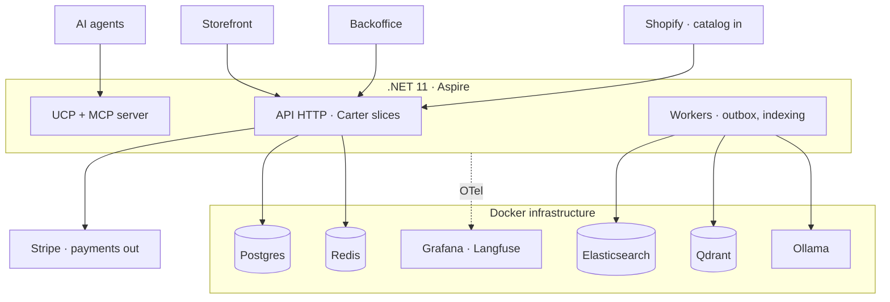
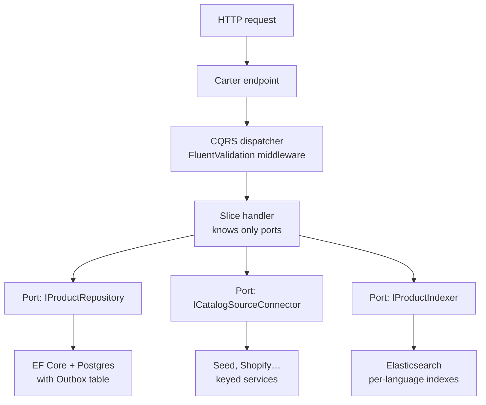
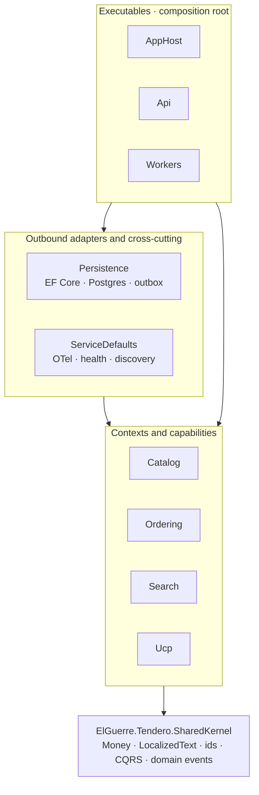

# Architecture

## Three planes

1. **Inbound** — catalog connectors (`ICatalogSourceConnector`): seed (default),
   Shopify dev store, Medusa/Vendure/WooCommerce/PrestaShop, Merchant feed.
   Keyed DI by source name; contract-test suite per adapter; idempotent import
   keyed on `(source, externalId)` via `ExternalReference`.
2. **Core** — the bounded contexts: `ElGuerre.Tendero.Catalog`,
   `ElGuerre.Tendero.Ordering`, `ElGuerre.Tendero.Pricing` and
   `ElGuerre.Tendero.Inventory`. They share no entities (ADR 0014); `Pricing` and
   `Inventory` reference SharedKernel alone, which is what makes the promotion
   engine a function of values and the allocation strategies testable without a
   database.
   Vertical slices (Carter endpoints + FluentValidation + custom CQRS
   dispatchers). Postgres is the source of truth; every side effect flows
   through domain events → Outbox (same transaction) → workers.
3. **Exposure** — storefront and backoffice (Angular) over HTTP; UCP + MCP
   server for AI agents (phase 3), with AP2 mandate handling and an agent
   activity panel in the backoffice.

## Canonical model

- `Product` (Catalog): `LocalizedText` name/slug/description (es/en with
  fallback chain), typed attributes, images, `ExternalReferences`, status
  Draft → Active → Archived. Draft = imported or AI-generated, awaiting review;
  only Active is indexed. **Publishing is an explicit step** — importing never
  does it — exposed as `POST /api/catalog/products/{id}/publish` and driven from
  the backoffice review queue. Idempotent: publishing what is already Active
  reports it and saves nothing (ADR 0012).
- `Order` (Ordering): line snapshots (name resolved in the buyer's culture,
  price frozen), declarative `AllowedTransitions` table, `IdempotencyKey` on
  checkout (agent retries are the normal case), `Culture`.
- SharedKernel: `Money`, `LocalizedText`, strongly-typed ids, `AggregateRoot`
  with domain-event collection.

## Search

- Index = disposable projection. One index per language with the native
  analyzer (`products_es` / `products_en`). Rebuilt from Postgres with
  `POST /api/search/reindex`, which replays the outbox projection's rule — Active
  is indexed, everything else removed — so it converges rather than merely adds.
  Elasticsearch runs without a volume on purpose; the rebuild is what makes that
  safe (ADR 0012).
- Lexical (BM25) is the permanent fallback; hybrid (Qdrant + RRF + rerank) and
  every AI layer sit behind feature flags and degrade to lexical.
- Multilingual embeddings (bge-m3 via Ollama) → one vector space serves both
  cultures.
- Quality is tested: golden set per culture, NDCG@10 + recall@50 in CI.

## HTTP surface

Everything the API exposes today. Each is one vertical slice.

| Endpoint | Slice |
|---|---|
| `POST /api/catalog/import` | `Catalog/Features/ImportProducts` |
| `GET /api/catalog/products` | `Catalog/Features/ListProducts` |
| `POST /api/catalog/products/{id}/publish` | `Catalog/Features/PublishProduct` |
| `GET /api/images/{id}` | `Catalog/Features/GetProductImage` |
| `GET /api/catalog/attributes` | `Catalog/Features/ListAttributeDefinitions` |
| `POST /api/catalog/products/{id}/variants` | `Catalog/Features/DefineVariants` |
| `POST /api/pricing/quote` | `Pricing/Features/QuoteCart` |
| `GET /api/pricing/promotions` | `Pricing/Features/ListPromotions` |
| `GET /api/inventory/stock` | `Inventory/Features/ListStock` |
| `PUT /api/inventory/stock/{sku}/{warehouse}` | `Inventory/Features/ListStock` (CountStock) |
| `GET /api/search` | `Search/Features/SearchProducts` |
| `POST /api/search/reindex` | `Search/Features/ReindexProducts` |

Any of them returning localized text resolves culture the same way — explicit
`?culture=` → `Accept-Language` → `es` — and answers with `Content-Language` and
`Vary: Accept-Language` (ADR 0013).

## Pricing

Prices are **quoted live and frozen at order time** (ADR 0016). `Pricing` is a
pure context: price lists, promotions and tax calculation take values in and
return values out, with the instant passed as an argument rather than read from
a clock. That is what lets the combination rules be verified with property tests
over thousands of generated carts.

Combination is a declarative table in the `AllowedTransitions` idiom —
`ExclusiveGlobal` stops evaluation, `ExclusiveInGroup` closes its group,
`Stackable` continues — evaluated in the total order `(Priority, Code)`. A
suppressed promotion is returned with its `RuleReason`, in both cultures, because
a discount that did not apply and a discount of zero look identical in a total.

A `PriceQuote` carries an expiry and a fingerprint over **both** the request and
the pricing data it was answered with, so a tariff edit invalidates the quotes it
would otherwise keep promising.

## Inventory, and the saga that was already there

Stock is keyed on **SKU**, not on `VariantId`: the SKU is the vocabulary the two
contexts share, exactly as `ProductName` is between Catalog and Ordering. Two
warehouses, `StockItem` with `OnHand`/`Reserved`/derived `Available`, and
`Reservation` with its own four-state transition table.

The process is **orchestrated from `Ordering` over the existing outbox** — three
`IDomainEventHandler<T>` and no framework (ADR 0024):

```
Order.Place()      → OrderPlaced     → IStockLedger.Reserve → held | refused
refused                              → order.Cancel(reason) → OrderCancelled
OrderCancelled                       → IStockLedger.Release        (compensation)
OrderShipped                         → IStockLedger.Commit
```

Holding stock does **not** confirm the order: `AllowedTransitions` routes
`Pending → PaymentAuthorized → Confirmed`, and stock says nothing about payment.

A stocktake is a different operation from a delivery, and only a stocktake can
say zero — which is what puts an out-of-stock shelf on the record rather than no
row at all. Both raise `StockLevelChanged`, so a count typed in the backoffice
reaches the search index by the same path an order takes.

## Payments

One port, three adapters: Fake (in-process, failure injection, default),
stripe-mock (protocol contract tests), Stripe test mode (real webhooks).
The order saga compensates via `Order.Cancel(reason)` from any intermediate
state.

## Observability

OpenTelemetry from slice 1: every I/O slice opens an `ActivitySource` span with
tags (source, counts, took, tokens). GenAI semantic conventions for LLM calls.
Aspire dashboard in dev; Grafana stack + Langfuse (self-hosted) as the
persistent view. Outbox lag is a first-class metric.

## Diagrams

### General architecture (containers)



### Component view (one vertical slice)



### Solution blueprint (project references point down only)



`Persistence` implements the ports the slices declare (`IProductRepository`,
`IUnitOfWork`, `IProductReader`) and is the only project that knows EF Core
exists; `Search` is the only one that knows Elasticsearch exists. Both facts are
architecture tests, not conventions. `Search` referencing `Catalog` is the one
edge that does not point straight down — see ADR 0007.

Architecture tests (`docs/testing.md`) enforce the downward-only rule; the
`tests/` and `frontend/` trees sit beside these layers without entering them.
